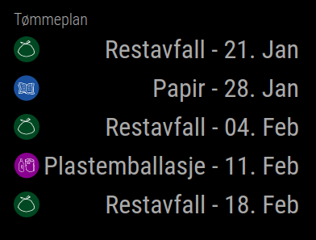
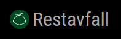

# MMM-TRV-WastePlan
A MagicMirror2 module for showing the waste plan for your destination in Trondheim, Norway.

##### Inspired by:
* https://github.com/blixhavn/MMM-AvfallshentingOslo/blob/main/MMM-AvfallshentingOslo.js
* https://github.com/jeroenpeters1986/MMM-ROVA-trashcalendar
* https://github.com/jonkristian/wasteplan_trv (for Home Assistant)

## Dependencies
  * A [MagicMirror<sup>2</sup>](https://github.com/MichMich/MagicMirror) installation

## Installation

In your terminal, go to your MagicMirror's Module folder:
````
cd ~/MagicMirror/modules
````

Clone this repository and install the dependencies:
````
git clone https://github.com/reidarw/MMM-TRV-WastePlan.git
````

Add the module to the modules array in the `config/config.js` file
and insert your own id. 

```
 {
    module: 'MMM-TRV-WastePlan',
    position: 'top_left',
    config: {
        id: 'e7853926-00f5-43ca-97b3-f013549b317b'
    }
 },
```
**Note:** 
The id can be found at https://trv.no/wp-json/wasteplan/v2/adress/?s=Your+street+name+21

Example:  https://trv.no/wp-json/wasteplan/v2/adress/?s=Lokes+veg+24

Returns:
```
[{"id":"e7853926-00f5-43ca-97b3-f013549b317b","adresse":"Lokes Veg 24"}]
```
Use the ID e7853926-00f5-43ca-97b3-f013549b317b

## Optional config
| **Option** | **Description** |
| --- | --- |
| `header` | Alternative header. Set as empty string to remove. Default: "Tømmeplan" |
| `numberOfWeeks` | Number of weeks to display. Default: 3 |
| `weekDay` | The number of the day in the week when the trash usually get picked up. Monday = 0, Tuesday = 1, Wednesday = 2, Thursday = 3, Friday = 4. Default: 3 |
| `blnNumberOfDays` | Display number of days until pickup. Default: true |
| `blnDate` | Display date for next pickup. Default: false |
| `dateFormat` | If blnDate is true, this date format will be used. Default: DD. MMM |
| `blnLabel` | Display label. Default: false |
| `blnIcon` | Display the same icons as your trash bin uses. Default: true |
| `minWidth` | Minimum width on container in pixels. Default: 160 |
| `updateInterval` | Interval to update the next pickup dates, in milliseconds. Default: 6 hours |


## Sample screenshot
### Update 2023-06: Screenshots are not updated. New icons and new garbage types are now supported after API v2 became available. 

Default:


With label and date:
```
blnLabel: true,
blnNumberOfDays: false,
blnDate: true,
```



Compact view (this week):
```
header: '',
numberOfWeeks: 1,
blnLabel: true,
blnNumberOfDays: false,
``` 

               
